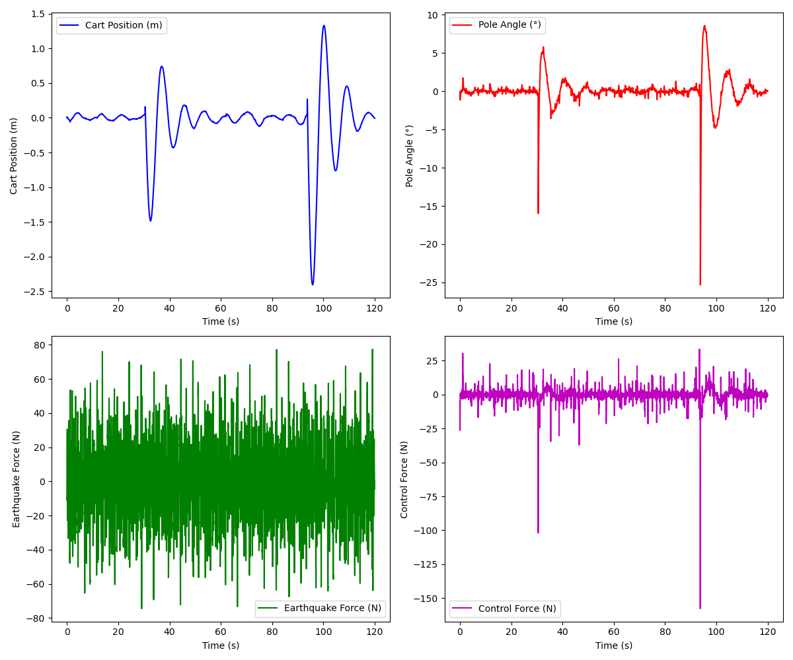
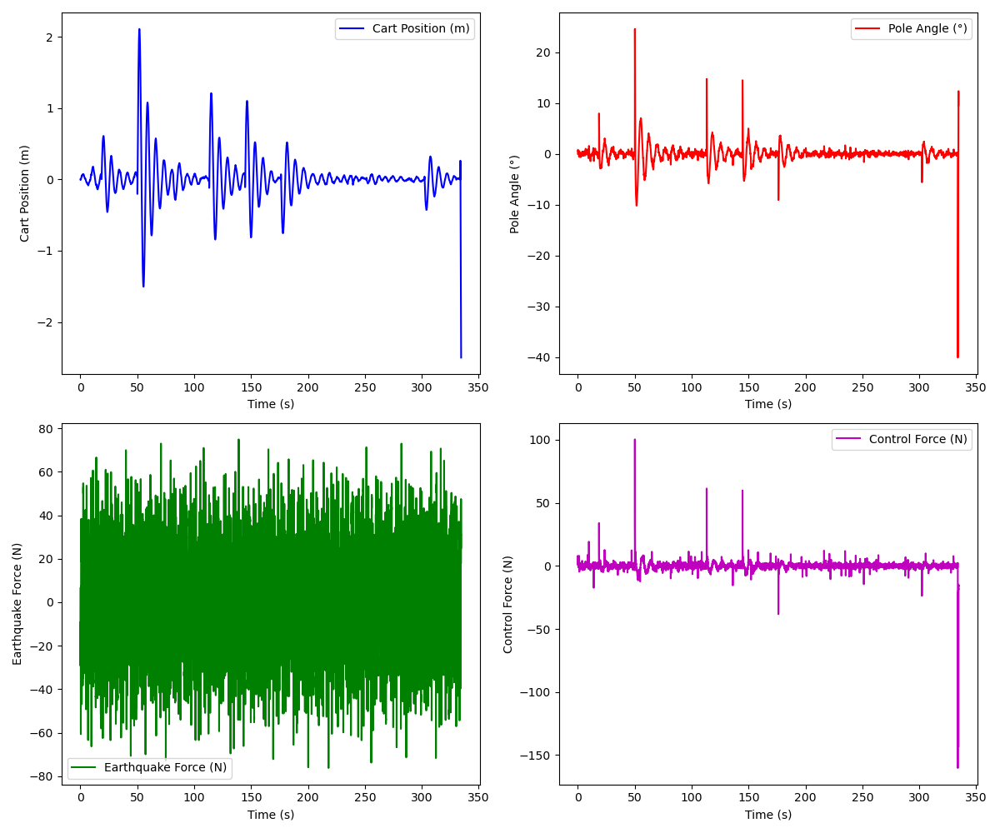

### LQR Controller Tuning Reflection
Starting Point - The Default Parameters were part of the repo as is
Q = diag([1.0, 1.0, 10.0, 10.0])  R = 0.1
The way I read this is a 1m cart error is penalized equally to a 1 rad/s angular velocity error, which makes no physical sense.

#### Iteration 1 - Competing Objectives Sweep (6,727 runs)
What I did:
 Independently scaled the cart states [x, x_dot] and angle states [theta, theta_dot] to reveal the trade-off.

What I found at fixed r_scale=1.0:
Priority	Q_angle / Q_cart	Cart displacement	Pole angle
Cart-heavy (ratio=0.18)	0.18	0.81m	19.3Deg
Balanced (ratio=1.0)	1.0	0.76m	16.6deg
Angle-heavy (ratio=5.5)	5.5	1.04m	14.8Deg
The trade-off is real: prioritizing pole angle lets the cart drift; prioritizing cart lets the pole tilt. However, at high overall Q scale (2.2, 2.2), the trade-off disappears - the controller is aggressive enough to protect both simultaneously. The ratio only matters when total gain is low.

#### Iteration 2 - Bryson's Rule as Baseline Major Failure
What I tried: 
  Replace the arbitrary Q baseline with Bryson's Rule - the principled method:

Q[i] = 1 / (max_acceptable_deviation[i])**2

With: x_max=2.5m, x_dot_max=5m/s, theta_max=0.3rad, theta_dot_max=2rad/s
Q = [0.16, 0.04, 11.11, 0.25]
What happened: 96% failure rate. Even the best config had cart=1.94m and theta=41Deg - barely surviving.
Why it failed: Bryson's rule hardcoded q_theta / q_x = 69.4x. The controller was so focused on the pole angle that it ignored cart drift. The earthquake kept pushing the cart sideways and the controller barely noticed until it was near the wall.

The lesson: Bryson's Rule is only as good as the tolerances you feed it. Choosing theta_max = 0.3 rad (17Deg) and x_max = 2.5 m (the full physical range) implicitly told the controller that the pole falling is 69 times more catastrophic per unit than the cart drifting. In an earthquake scenario where both are attacked simultaneously, that is wrong.

#### Iteration 3: Direct Bryson Tolerance Sweep 12,096 runs
What I did: 
Instead of picking one set of tolerances, sweep them directly. Let the data tell you which tolerances work.

x_tol: 0.5m - 2.5m  (8 values)
xdot_tol: 1.0 - 5.0 m/s (6 values)
theta_tol: 0.20 - 0.50 rad (6 values)
thetadot_tol: 0.5 - 2.8 rad/s (6 values)
r_scale: 0.5 - 1.8  (7 values)

What I found:
x_tol	Pass rate
0.5m (tight)	21%
2.5m (loose)	8%
Tightening x_tol is the most powerful lever. Setting x_tol=0.5m raises Q[x] from 0.16 to 4.0 - the controller fights cart drift 25x harder than with the naive Bryson baseline.

#### Best configuration found:
x_tol=0.5m, xdot_tol=1.0, theta_tol=0.2rad, thetadot_tol=0.5
- Q = [4.0, 1.0, 25.0, 4.0]  R = 0.05
- q_theta / q_x = 6.25x  (vs 69x from naive Bryson or manual tunning I tried)
- Survived 400s (full MAX duration assigned, this was not consistent each time but 3/5 trials led to full max duration)
- Max cart displacement: 1.41m within +-2.5m limit
- Max pole angle: 31.9Deg within 45Deg limit
- Avg control effort: 23.9N

I am not able to figure out why my stability was consistently low: TODO

#### Key Learnings
The Q ratio matters more than the Q magnitude.
The ratio q_theta / q_x determines what the controller defends. The naive Bryson ratio of 69x destroys cart stability. The swept optimum of ~6x balances both objectives under earthquake disturbance.
Tight tolerances = aggressive controller = better performance.
Counterintuitively, telling the controller keep the cart within 0.5m (even though it physically can't) forces high Q[x] that actually reduces observed cart displacement from 1.9m to 1.4m.

**Low R is consistently better.**
Across all sweeps, lower R (less penalty on control effort) always wins. The system has a 15N earthquake and needs an aggressive response. Penalizing force usage hurts more than it saves.
Bryson's Rule requires physical insight, not just physical limits.
Setting tolerances to the hardware limits (x_max=2.5m) gives a controller calibrated for don't hit the wall - too relaxed for disturbance rejection. The tolerances should reflect desired performance, not just survival boundaries. The score function shapes what best means. 
score = survival - 0.5·cart - 0.02·theta - 0.03·effort
Cart displacement is penalized 25x more than theta per degree/meter. This is why tight x_tol matters most - the score function rewards reducing cart displacement the most.

## RL - DQN
DQN has 2 discrete actions (push left/right with fixed force) against a 15N earthquake. LQR applies proportional continuous force. The DQN is fighting a much harder battle, limited to ±10N bang-bang type occilation, when the earthquake pushes at 15N, the best possible response is 10N back. It's always 5N short. The agent learned good policy (perfect CartPole without earthquake), but the action space fundamentally can't match the disturbance magnitude.

#### Reward Shaping
- I updated reward with alive bonus, which is everystep the pole is within threshold and upright add +1. Total reward is alive+ angle + position 
- I added +5 if the episode ends due to timeout or survival which adds strong negative reward if dead and positive reward for surviving full horizon.
- In original implementation it had an issue where truncated which is time-limit success was being treated like failure.
- Normalized angle and position rewards by their thresholds, then aligned thresholds to LQR limits (x=2.5m, theta=45deg) for fair comparison.
- The cart seems to occilate or is the policy learned to balance pole, and these occilations grow over time to compensate for greater and greater previous stabelization attempt, eventually failing, so I added velocity penalties theta_dot, later x_dot to reduce oscillation and cart chattering and that helped.

Scenario 1: With earthquake vs without earthquake
-  No Earthquake, Pass rate= 100%, Survival steps=240/240
-  With 15N Earthquake Pass rate= 0%(every episode), Steps =	57.7 mean (42-79 range)

Scenario 2: With Failure penalty changes which adds positive reward for survival with timeout and negative only for dead.
- Pass rate - 0-40%(avg 10% pass rate) - Steps 153 mean (72-240)

#### Itterative Improvement: 

- Currently exploration decay is set to 0.999 with 0.1 epsilon, and the total episodes are 15000 by default, this was updated because the decay leads the exploration to end within the first 800 episodes.

- Earthquake force:
      # Apply earthquake force to the environment
        env.unwrapped.force_mag = env.unwrapped.force_mag + earthquake_force  

  The force is applied in the code like below but it modifies position only, not velocity. Which in the playback looks like an impulse on position, teleporting the cart sideways, rather than a physical force. Ideally earthquake force should affect x_dot, and x not just x.

- Eval and Train Threeshold for X and Theta
 DQN current implementation
  max_theta: 0.21-0.25 rad, all just over 12deg, which led to end of episode dying from theta every time quickly.
  max_cart: 0.47-0.68m, well within 2.4m and nowhere close to cart limit
The agent dies exclusively from the pole angle. The 12deg theta threshold. And the reward function reinforces this asymmetry, angle_bonus normalizes by ~0.21 rad, so small angle changes create huge reward gradients, while position_bonus normalizes by 2.4m, so the cart just drift freely.

For comparison with your LQR thresholds which has 2.5m cart limit, 45deg pole limits. The DQN is operating under a 3.75x tighter angle constraint than LQR. That's not a 1:1 comparison.
