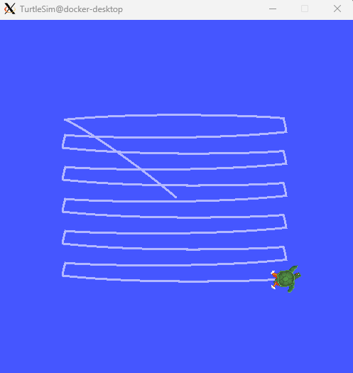
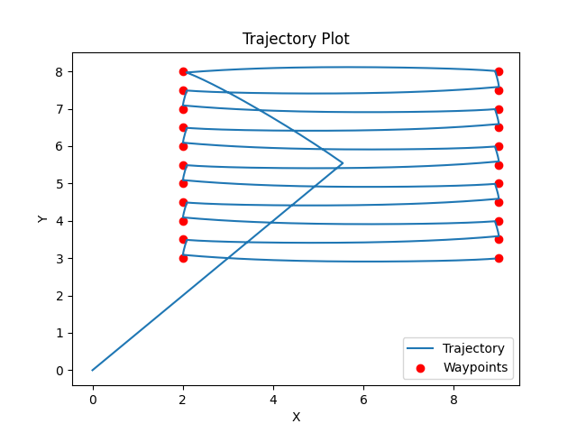
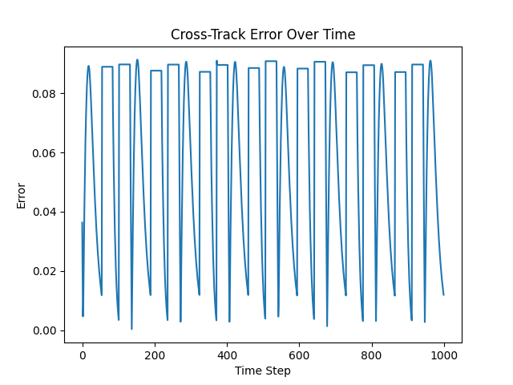
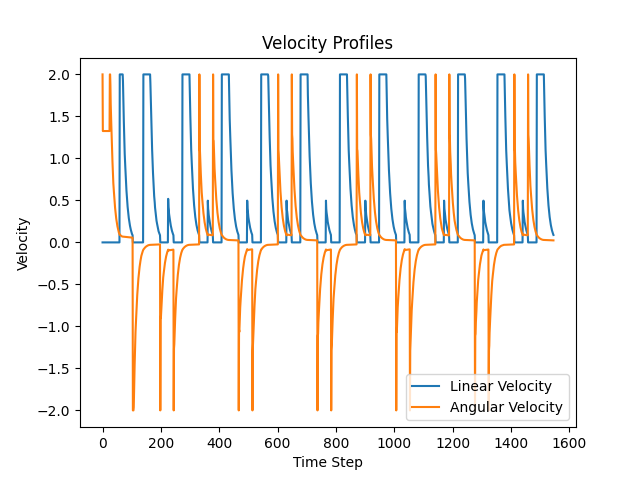

# First-Order Boustrophedon Navigator

A PD-controlled lawnmower survey pattern using ROS2 Turtlesim. The turtle executes uniform horizontal sweeps with alternating direction, minimizing cross-track error via tuned PD gains.

## Running with Docker

All dependencies are included in the course Docker image.

```bash
# Start the container
docker-compose up -d
docker-compose exec space-robotics-dev bash

# Inside the container
cd /workspace/src
./rebuild-and-fix.sh
ros2 launch first_order_boustrophedon_navigator boustrophedon.launch.py
```

To tune parameters live, open a second terminal:
```bash
docker-compose exec space-robotics-dev bash
source /workspace/install/setup.bash
ros2 run rqt_reconfigure rqt_reconfigure
```

## What Was Implemented

### 1. Waypoint Generation Fix
The original `generate_waypoints()` used `len(waypoints) % 2` to alternate sweep direction. Since waypoints are always added in pairs, this value is always even the pattern never alternated, causing diagonal returns between every pass. Replaced with a `going_right` boolean flag that toggles each iteration.

### 2. Turn-in-Place Control
The original controller computed linear and angular velocity simultaneously. This caused the turtle to drift forward while turning, producing curved transitions between sweeps. Added a threshold check if `abs(angular_error) > 0.1 rad`, linear velocity is set to zero. The turtle turns in place first, then drives straight.

### 3. Velocity Capping
- Linear velocity clamped to `[0.0, 2.0]` — prevents reversing on waypoint overshoot
- Angular velocity clamped to `[-2.0, 2.0]` — prevents jerky snapping during turns

### 4. PD Controller Tuning
| Parameter | Original | Tuned | Rationale |
|-----------|----------|-------|-----------|
| `Kp_linear` | 10.0 | 2.0 | 10.0 caused overshooting at waypoints. 2.0 gives smooth deceleration |
| `Kd_linear` | 0.1 | 0.3 | Higher damping smooths velocity on straight segments |
| `Kp_angular` | 5.0 | 4.0 | Slightly reduced to lower oscillation at corners |
| `Kd_angular` | 0.2 | 1.0 | 0.2 was critically underdamped. 1.0 gives near-critical damping on turns |
| `spacing` | 1.0 | 1.0 | Unchanged, changing spacing did not provide better coverage or pattern |

## Tuning Methodology

The tuning process followed a two-phase approach: structural corrections first, then iterative PD gain adjustment.

### Structural Fixes

To best of my understanding code had two bugs that made tuning pointless regardless of gain values. The waypoint generator never alternated sweep direction because `len(waypoints) % 2` is always 0 when waypoints are appended in pairs every sweep went left-to-right, producing diagonal returns instead of a lawnmower pattern. Separately, the controller applied linear and angular velocity simultaneously, so the turtle drifted forward during every turn. My approach here was an added the `going_right` flag and the turn-in-place threshold before any gains were changed allowing for perfect turns 90 deg and smooth transition, I could not get my track to be perfectly straight but error is 0.08 on high side which is order of magnitude better than required 0.2.

### Iterative Gain Adjustment

With the structural issues fixed, the baseline gains (`Kp_linear=10`, `Kd_linear=0.1`, `Kp_angular=5`, `Kd_angular=0.2`) were tested and the observed behaviours drove each change, I started with Kp linear and made my way through rest, I tried to use grid search approach where I could run kp linear between 0.5 and 10 and see where do we get lowest error but that didnt work due to time complexity, so I did careful bruteforce tunning:

- **`Kp_linear` 2** At 10.0 the turtle overshot every waypoint, oscillating around the target before advancing. Reducing to 3.0-2.0 produced a smooth deceleration into each waypoint.
- **`Kd_angular` 1.0** The largest single change. At 0.2 the angular response was critically underdamped: the turtle swung well past the target heading before correcting, visible as a wavy entry into each sweep. Raising to 1.0 brought the system to near-critical damping a single, clean approach to the target heading with no overshoot.
- **`Kp_angular` 4** Minor reduction to eliminate residual oscillation at corners after the `Kd_angular` adjustment.
- **`Kd_linear` 0.3** Small increase to smooth velocity on straight segments, removing minor fluctuations visible in the velocity profile.
- **Velocity caps** (`linear [0, 2]`, `angular [-2, 2]`) were set to the maximum velocities observed during normal operation. The linear lower bound of 0 prevents reversing on waypoint overshoot; the angular caps prevent jerky heading snaps during turns.

## Final Parameters (`config/boustrophedon_params.yaml`)

```yaml
Kp_linear:  2.0
Kd_linear:  0.3
Kp_angular: 4.0
Kd_angular: 1.0
spacing:    1.0
```

## Results

**TurtleSim — live trajectory** (uniform horizontal sweeps with an initial diagonal from the spawn point to the first waypoint):



**Planned vs actual trajectory** (red dots = waypoints, blue line = path taken):



**Cross-track error over time** — peaks at approximately 0.09, well below the 0.2 target. Periodic drops to zero correspond to waypoint transitions where the error resets:



**Velocity profiles** — linear velocity (blue) runs at the 2.0 cap on straights and drops to zero during turn-in-place phases; angular velocity (orange) shows sharp spikes capped at ±2.0 only during turns:



## Monitoring Performance

```bash
# Cross-track error values
ros2 topic echo /cross_track_error

# Plot error and velocity live
ros2 run rqt_plot rqt_plot
# Topics: /cross_track_error, /turtle1/cmd_vel/linear/x, /turtle1/cmd_vel/angular/z
```

Plots (cross-track error, trajectory, velocity profiles) are automatically saved as PNG files when the pattern completes.

